# AWS 開発環境 Terraform 設計メモ

執筆日: 2025-10-15

## 想定要件

- 単一 VPC にアプリケーション層 (EC2/ECS など) とデータベース層 (Amazon RDS for MySQL) を配置する。
- それぞれをプライベートサブネットに分離し、最小構成の EC2 と RDS を Terraform で構築できるようにする。
- 将来的に ECS や ALB/NLB、VPC Endpoint を追加しやすい構成にする。

## 必要な主な AWS リソース

| レイヤ | リソース | メモ |
| --- | --- | --- |
| ネットワーク | VPC (`10.20.0.0/16` など) | 開発環境専用の VPC を 1 つ作成。オンプレ/VPN と重ならない CIDR を選定。 |
| ネットワーク | プライベートサブネット (アプリ用 ×2) | 例: `10.20.10.0/24`, `10.20.11.0/24`。利用するのは AZ1、AZ2 は将来用に予約。 |
| ネットワーク | プライベートサブネット (DB 用 ×2) | 例: `10.20.20.0/24`, `10.20.21.0/24`。RDS の DB サブネットグループに使用。 |
| ネットワーク | パブリックサブネット (任意) | NAT ゲートウェイや踏み台を置く場合に使用。今回の最小構成では未使用でも可。 |
| ネットワーク | ルートテーブル | サブネットごとにルールを分け、必要に応じて NAT ゲートウェイや VPC Endpoint へルーティング。 |
| ネットワーク | NAT ゲートウェイ | アプリ層がインターネットへ出る場合に設置。コストが気になる場合は後から追加。 |
| ネットワーク | Interface VPC Endpoint | SSM/SSMMessages/EC2Messages/CloudWatch Logs/Secrets Manager などへのプライベート接続を確保。今回実際に配置。 |
| セキュリティ | セキュリティグループ (アプリ層) | アプリケーションから外部/DB への通信を制御。RDS からの許可元として利用。 |
| セキュリティ | セキュリティグループ (DB 層) | インバウンドをアプリ層 SG のみ許可。アウトバウンドは必要最小限。 |
| セキュリティ | IAM ロール (EC2/ECS, SSM) | Session Manager・CloudWatch Logs などの権限を付与。 |
| 計算 | EC2 (開発用最小構成) | `t2.nano` の踏み台/検証用インスタンス。将来 ECS/Fargate へ置き換え。 |
| データベース | RDS MySQL (Multi-AZ 任意) | `aws_db_instance`。Secrets Manager 参照や IAM 認証を設定。 |
| データベース | DB サブネットグループ | RDS が使用するサブネット集合 (`aws_db_subnet_group`)。 |
| データベース | DB パラメーターグループ | デフォルトから変更が必要な場合に作成。 |
| データベース | Secrets Manager Secret | DB 認証情報を格納。Terraform は参照のみ。 |
| 運用 | CloudWatch Logs/Alarms (任意) | EC2/RDS のログ・メトリクス監視。 |
| 運用 | SSM Session Manager | 踏み台なしでインスタンスへ接続するための設定。Interface Endpoint と併用。 |

## 想定ディレクトリ構成

```
infra/
├── modules/
│   ├── network/
│   └── rds/
├── envs/
│   ├── dev/
│   │   ├── main.tf
│   │   ├── variables.tf
│   │   ├── outputs.tf
│   │   └── terraform.tfvars
│   └── dev_backend/
│       └── main.tf  (S3/DynamoDB backend)
└── README.md
```

- `modules/network`: VPC、サブネット、ルートテーブル、セキュリティグループ、VPC Endpoint などをモジュール化。
- `modules/rds`: DB サブネットグループ、パラメーターグループ、RDS 本体、Secrets 参照を定義。
- `envs/dev`: 実際の開発環境コード (Live) で上記モジュールを呼び出す。
- Backend 設定は別ディレクトリに切り出し、S3 バケットと DynamoDB ロックを構築。

## 構成図 (Mermaid)

```mermaid
architecture-beta
    group vpc(logos:aws-vpc)[VPC 10_20_0_0_16]

    service load_balancer(logos:aws-elb)[ALB] in vpc

    %% az1
    group az1[AZ1] in vpc
    group app_az1_private_subnet[App Private Subnet 10_20_10_0_24] in az1
    group db_az1_private_subnet[DB Private Subnet 10_20_20_0_24] in az1
    service appserver1(logos:aws-ec2)[app server 1] in app_az1_private_subnet
    service dbserver1(logos:aws-rds)[Primary DB] in db_az1_private_subnet

    %% az2
    group az2[AZ2] in vpc
    group app_az2_private_subnet[App Private Subnet 10_20_11_0_24] in az2
    group db_az2_private_subnet[DB Private Subnet 10_20_21_0_24] in az2
    service appserver2(logos:aws-ec2)[app server 2] in app_az2_private_subnet
    service dbserver2(logos:aws-rds)[Read Replica] in db_az2_private_subnet

    junction asg_junction in vpc
    junction aurora_junction in vpc

    load_balancer:R -- L:asg_junction
    asg_junction:T -- B:appserver1
    asg_junction:B -- T:appserver2
    appserver1:R -- L:dbserver1
    appserver2:R -- L:dbserver2

    aurora_junction:T -- B:dbserver1
    aurora_junction:B --> T:dbserver2
```



> app server から DB server への TCP 3306 のみ許可。
> SSM や Secrets Manager など AWS サービスへのアクセスは Interface VPC Endpoint で閉じ、必要なら NAT Gateway を併用して外部通信を許可する。

## Q & A

### Q: VPC は 1 つで良い？

A: 開発環境であれば 1 VPC 内にアプリ層と DB 層を収容し、サブネットで分離する構成で問題ありません。将来的に環境を増やす場合も、環境ごとに VPC を分ける形が一般的です。

### Q: アプリ用サブネットと DB 用サブネットは分けるべき？

A: はい。役割ごとに分離することでセキュリティやルーティングを個別に調整できますし、RDS は DB サブネットグループに最低 2 サブネットが必要なので、アプリ用とは別にサブネットを用意しておくのが自然です。

### Q: RDS へのインバウンドをアプリケーションからの通信だけに絞れる？

A: RDS に割り当てるセキュリティグループで、送信元としてアプリケーション用セキュリティグループのみ許可すれば実現できます。CIDR ではなく SG 参照を使うことで、将来アプリ層がスケールアウトしても設定を維持しやすくなります。

### Q: 開発用の EC2 は必須？

A: 必須ではありませんが、Session Manager で接続する踏み台や検証用の EC2 を t2.nano/t4g.small などで 1 台置いておくと便利です。将来 ECS/Fargate に移行する場合は削除し、ECS サービスに置き換えます。

### Q: NAT ゲートウェイは初期構築から必要？

A: アプリがインターネットへ出る必要があるなら設置しますが、コストを抑えたい開発環境では最初は置かずに VPC Endpoint や Session Manager で代替する方法もあります。必要になったタイミングで追加できます。

### Q: Session Manager で接続する場合、インターネット経由は必須？

A: いいえ。EC2 から AWS Systems Manager の各エンドポイント (SSM、SSMMessages、EC2Messages、CloudWatch Logs) に到達できればよく、経路は

- NAT Gateway/インスタンス経由でインターネットへ出す方法
- Interface VPC Endpoint (`com.amazonaws.<region>.ssm` など) を作成して VPC 内で完結させる方法

の 2 つです。セキュリティを高めたい場合は VPC Endpoint を推奨します。

### Q: Terraform の state はどう管理する？

A: S3 バケット + DynamoDB ロックによるバックエンド構成が一般的です。環境ごとにプレフィックスを分け、`terraform.tfvars` で環境固有の値を管理するとレビューしやすくなります。

### Q: サブネットへのアクセスはどのように絞れる？

A: サブネット単位では主に 3 層で制御します

1. ルートテーブル: 宛先 CIDR と次ホップ (インターネットゲートウェイ、NAT、VPC Endpoint など) を定義し、レイヤ 3 で経路を制限します。
2. ネットワーク ACL: サブネットに紐づく stateless なフィルタで、番号付きの許可/拒否ルールを双方向に設定します。ステートレスなので戻り通信も明示的に許可が必要です。
3. セキュリティグループ: ENI 単位で適用されるステートフルなファイアウォールで、必要な通信のみ許可します。実運用ではルートテーブルで外部経路を最小化し、細かな許可はセキュリティグループで制御する構成が一般的です。

### Q: セキュリティグループはどういう仕組み？

A: セキュリティグループは ENI（Elastic Network Interface）にアタッチされるステートフルファイアウォールで、許可ルールのみを記述します。インバウンド/アウトバウンドともデフォルト拒否で、許可した通信はコネクション追跡により戻りトラフィックが自動的に通過します。送信元・送信先は CIDR だけでなく他のセキュリティグループも指定できるため、「sg-app から sg-db」など論理的な関連付けでアクセス制御を表現できます。
